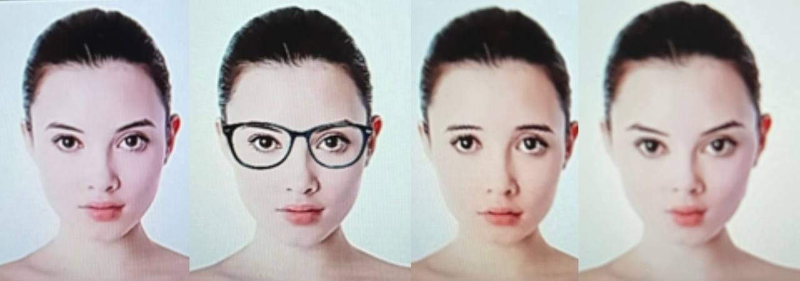
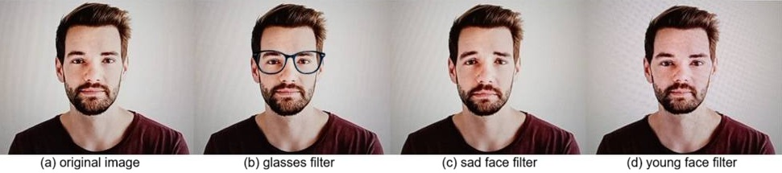
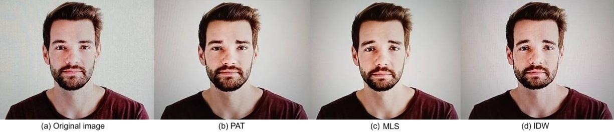

#  *Reflekt - a practical exploration of computer vision techniques in constrained mobile environments.*

**Reflekt** is an implementation of facial image warping techniques on mobile devices. This application demonstrates three computer vision methodologies working in tandem with MediaPipe Face Mesh to create real-time expressive filters, providing insights into algorithm performance, optimization strategies, and visual quality trade-offs.

<!-- Tech Stack -->
## 🛠️ Technology Stack

| Layer | Technology | Purpose |
|-------|------------|---------|
| **UI** | Jetpack Compose | Modern declarative UI |
| **Vision** | MediaPipe Face Landmarker | Facial feature detection |
| **Warping** | IDW, PAT, MLS Algorithm | Smooth face transformation |

> [!NOTE]
> This is a CPU-only implementation, therefore the processing is slow. Future improvements could include GPU acceleration for faster performance.

## 🎥 Demo

## Project Overview

The app applies facial filters by manipulating facial landmarks detected with MediaPipe FaceMesh. The main filters include:

- Glasses Filter: Overlays glasses images based on landmarks; rotates according to the face’s roll angle.

- Sad Filter: Moves corners of the mouth down and adjusts eyebrows.

- Young Face Filter: Exaggerates features for a young face effect.

\
\
\
[Image source: By Unknown author sourced from https://www.freepik.com/]

Three warping algorithms were tested:

- Inverse Distance Weighting (IDW): Primary method used in the final prototype. Smoothly interpolates landmark movements across the face. Chosen for its visual quality and simplicity.

- Moving Least Squares (MLS): Produces high-quality warping but is slower and more computationally heavy.

- Piecewise Affine Triangulation (PAT): Demonstrates the highest FPS. However, this performance advantage comes at the cost of visible triangle boundary seams.

Table below summarizes the key characteristics of the three warping algorithms implemented in this project:

|Algorithm|	Mathematical Basis|	Scope|	Representation|	Time Complexity|	Space Complexity|
|---|---|---|---|---|---|
IDW|	Distance-weighted interpolation (Shepard, 1968)|	Global|	Control Point|	O(W·H·N)|	O(W·H)|
MLS|	Energy minimization with affine/ similarity/ rigid constraints (Schaefer et al., 2006)|	Local|	Control Point|	O(W·H·N)|	O(W·H)|
PAT|	Delaunay triangulation + per-triangle affine transforms (Beier & Neely, 1992)|	Local|	Mesh|	O(W·H)|	O(W·H)|

Sad face filter implementation using different warping techniques: 

### 🎭 Visual Comparison

[Image source: By Unknown author sourced from https://www.freepik.com/]

### ⚡ Performance metrics
| Technique | FPS |ms/frame|Memory usage (MB)|Artifacts|
|-----------|-----|--------|-----------------|---------|
|PAT        |15-20|50-100  |10-15  |Triangle boundary seams|
|MLS        |0-1  |6000+   |10-15  |None visible (similar to IDW)|
|IDW        |5-10 |100-200 |10-15 |Slight global smoothing|

Built with ❤️ by Anastasiia Shvydkaia